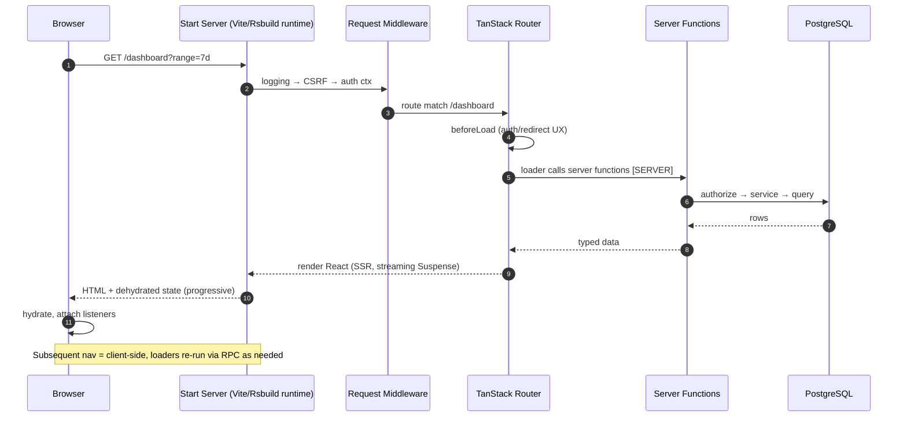

# Production TanStack Start — The Complete Full-Stack Course

> **A serious, current, production-grade course on building full-stack React applications with TanStack Start.**
> Course context date: **September 2026**. Every version and API in this course was verified against the
> official npm registry and official TanStack documentation on **2026-09-28** — not copied from stale tutorials.

---

## 1. Course Philosophy

Most TanStack Start content on the internet falls into one of these traps:

- It's really a **TanStack Router tutorial** wearing a Start hat.
- It's a **Next.js tutorial translated** into Start syntax.
- It's a **random collection of TanStack libraries** with no architecture.
- It stops at **CRUD** and never touches auth, multi-tenancy, security, or deployment.

This course is none of those. The thesis is:

> **TanStack Start is an application platform.** It is a *router-first* full-stack framework where the routing
> model is the application contract, the server is an explicit and visible participant, and type safety spans
> the entire boundary between URL, router, server, database, and UI.

We teach Start the way a staff engineer would explain it to your team: **what it is, why it exists, where
every line of code runs, what the security implications are, and when NOT to use a feature.**

The golden question this course answers over and over:

> **“WHY TANSTACK?”** — because type-safe routing, route-centric data loading, search-param schemas, an
> explicit server boundary, composable middleware, and deployment flexibility are genuinely different ideas,
> not marketing.

## 2. Who This Course Is For

You, if:

- You are comfortable with React (hooks, components, suspense basics) and modern TypeScript.
- You have built at least one non-trivial app (any framework).
- You want to build **production** systems: auth, RBAC, multi-tenancy, testing, observability, deployment.
- You are evaluating or migrating to TanStack Start and want the *honest* picture, including maturity caveats.

## 3. Prerequisites

| Skill | Level needed |
|---|---|
| TypeScript | Intermediate (generics, inference, module systems) |
| React | Intermediate (hooks, context, Suspense basics) |
| HTTP | Basic (methods, status codes, headers, cookies) |
| SQL | Basic (tables, joins, indexes) |
| Git | Working knowledge |

## 4. Learning Outcomes

By the end you will be able to answer, and build against:

1. How a request flows through Start: **URL → route matching → middleware → loaders → SSR/streaming → hydration → client navigation**.
2. **Where code runs** — the `[SERVER] / [CLIENT] / [SERVER → CLIENT] / [BOTH]` discipline.
3. The difference between **server-side rendering** and **server-only execution** (they are NOT the same).
4. When to use **router loader cache** vs **TanStack Query** — a real decision framework.
5. When to use a **Server Function** vs a **Server Route** — with a decision matrix.
6. How to build **authentication** (better-auth, HTTP-only sessions) and **authorization** (RBAC, ownership, per-endpoint enforcement).
7. A clean **server architecture**: Server Function → authorization → service → repository → PostgreSQL (Drizzle).
8. Deep URL state: validated, typed **search params** driving filters, pagination, sorting, tables.
9. **Streaming SSR** dashboards, optimistic UI, virtualized lists, admin tables.
10. **Multi-tenant isolation** enforced at the data boundary.
11. A real **security model**: CSRF, cookies, CSP, IDOR, rate limiting, secrets.
12. A full **testing pyramid** (Vitest, RTL, MSW, Playwright) for a full-stack app.
13. **Deployment** to Cloudflare Workers, Node/Docker, Netlify, Railway — and the runtime tradeoffs.
14. A capstone: **a multi-tenant SaaS operations & commerce platform**, designed by YOU and reviewed senior-style.

## 5. Current TanStack Start Status (verified 2026-09-28)

> Full evidence and citations: [`course/00-verified-stack.md`](course/00-verified-stack.md)

**TanStack Start is in the Release Candidate stage.** The official docs state it is *feature-complete with an
API considered stable*, but it has not been declared 1.0-stable yet. npm's `latest` tag publishes the RC line
(`1.168.x`). It is used in production by real teams (including official hosting partners Cloudflare, Netlify,
Railway). Treat it as: **safe to build serious products on, but pin versions and read release notes.**

| Feature | Status in this course |
|---|---|
| TanStack Router (routing, loaders, search params, cache) | ✅ **Stable** — course core |
| Full-document SSR | ✅ **Stable** |
| Streaming SSR | ✅ **Stable** |
| Server Functions (`createServerFn`) | ✅ **Stable** |
| Server Routes (`server.handlers` in file routes) | ✅ **Stable** |
| Middleware (`createMiddleware`, request + function) | ✅ **Stable** |
| Cookies / sessions utilities | ✅ **Stable** |
| Deployment integrations (Cloudflare, Netlify, Nitro, Node, Vercel, Bun) | ✅ **Stable** (partner plugins) |
| React Server Components | ⚠️ **Experimental** — clearly labeled, never the foundation |

## 6. Verified Stack (September 2026)

Every version below was read from the npm registry `latest` dist-tag on 2026-09-28.

| Layer | Technology | Version | Docs |
|---|---|---|---|
| Framework | `@tanstack/react-start` | `1.168.59` (RC line) | [tanstack.com/start](https://tanstack.com/start/latest/docs/framework/react/overview) |
| Router | `@tanstack/react-router` | `1.170.40` | [tanstack.com/router](https://tanstack.com/router/latest/docs/framework/react/overview) |
| UI library | React | `19.3.0` | [react.dev](https://react.dev) |
| Language | TypeScript | `7.0.2` (native compiler GA; 6.x also fine) | [typescriptlang.org](https://www.typescriptlang.org) |
| Build tool | Vite | `8.3.1` (Start peers `>=7`; Rsbuild `^2` also supported) | [vite.dev](https://vite.dev) |
| Server state | `@tanstack/react-query` | `5.104.0` | [tanstack.com/query](https://tanstack.com/query/latest/docs/framework/react/overview) |
| Forms | `@tanstack/react-form` | `1.33.5` (stable v1) | [tanstack.com/form](https://tanstack.com/form/latest/docs/framework/react/overview) |
| Tables | `@tanstack/react-table` | `9.2.4` (v9) | [tanstack.com/table](https://tanstack.com/table/latest/docs/introduction) |
| Virtualization | `@tanstack/react-virtual` | `3.14.13` | [tanstack.com/virtual](https://tanstack.com/virtual/latest/docs/introduction) |
| Validation | Zod | `4.6.5` | [zod.dev](https://zod.dev) |
| ORM | Drizzle ORM (primary) | `0.45.3` | [orm.drizzle.team](https://orm.drizzle.team) |
| ORM (documented alt) | Prisma (official Start auth example uses Prisma 7) | `7.x` | [prisma.io](https://www.prisma.io/docs) |
| Database | PostgreSQL | 16/17 | [postgresql.org](https://www.postgresql.org/docs/) |
| Auth | Better Auth (official Start integration) | `1.7.6` | [better-auth.com](https://www.better-auth.com/docs/integrations/tanstack) |
| Styling | Tailwind CSS | `4.3.3` | [tailwindcss.com](https://tailwindcss.com) |
| UI components | shadcn/ui (Radix primitives) | current | [ui.shadcn.com](https://ui.shadcn.com) |
| Animation | Motion | `13.4.4` | [motion.dev](https://motion.dev) |
| Unit/integration tests | Vitest | `5.0.2` | [vitest.dev](https://vitest.dev) |
| Component tests | React Testing Library | current `@testing-library/react` | [testing-library.com](https://testing-library.com) |
| API mocking | MSW | `3.0.0` | [mswjs.io](https://mswjs.io) |
| E2E tests | Playwright | `1.63.0` | [playwright.dev](https://playwright.dev) |
| Runtime/hosting | Nitro (optional host), srvx, Workers, Node ≥ 22.12 | — | see module 30 |

**Why each technology was selected** is explained in [`course/00-verified-stack.md`](course/00-verified-stack.md#why-each-technology).

## 7. TanStack Ecosystem Map

```
                              TANSTACK ECOSYSTEM (2026)
                                       │
        ┌──────────────┬───────────────┼───────────────┬──────────────┐
        │              │               │               │              │
      START          QUERY           TABLE            FORM         VIRTUAL
   (framework)    (async state)   (headless grid)  (headless    (headless
        │              │               │            forms)      virtualization)
     ROUTER ───────────┘               │               │              │
   (routing core)      │               └───────────────┴──────────────┘
        │           (dehydrate/hydrate          used together inside
   ┌────┴─────────┐  across SSR boundary)      START's UI layer)
   │              │
 SERVER RUNTIME   VITE / RSBUILD
 (SSR, streaming, (build: client bundle
  server entry)    + server bundle)
   │
   ├── SERVER FUNCTIONS  (type-safe same-origin RPC)  ← protected by CSRF middleware
   ├── SERVER ROUTES     (public HTTP endpoints)      ← same file-based routing
   └── MIDDLEWARE        (request + function, composable)

   OUTSIDE TANSTACK (course picks):
   Zod (validation) · Drizzle + PostgreSQL (data) · Better Auth (auth)
   Tailwind + shadcn/ui (UI) · Motion (animation) · Vitest/MSW/Playwright (tests)
```

## 8. Complete Roadmap

| Phase | Module | Title |
|---|---|---|
| Foundations | 00 | Verified stack, versions, maturity, what's experimental |
| | 01 | The TanStack Start mental model & execution model |
| | 02 | Project setup: CLI, Vite, Tailwind v4, project anatomy |
| Router core | 03 | TanStack Router deep dive: route trees & file-based routing |
| | 04 | Type-safe routing: the compiler as your co-pilot |
| | 05 | Search params deep dive: the URL is your state |
| | 06 | Route loaders & `beforeLoad`: route-centric data loading |
| | 07 | The router cache & preloading (SWR model) |
| Rendering | 08 | SSR & hydration from first principles |
| | 09 | Streaming SSR with Suspense |
| Server platform | 10 | Server Functions in depth |
| | 11 | Server Routes (HTTP endpoints) |
| | 12 | Server Functions vs Server Routes · BFF & API architecture |
| | 13 | Middleware: request + function, composition, ordering |
| Security & identity | 14 | Authentication: sessions, cookies, Better Auth |
| | 15 | Authorization & RBAC: roles, permissions, ownership |
| Data | 16 | PostgreSQL + Drizzle: schema, migrations, transactions |
| | 17 | Server architecture: services/repositories + Zod validation |
| Client data & UI state | 18 | TanStack Query in Start (and router cache vs Query) |
| | 19 | TanStack Form (vs React Hook Form) |
| | 20 | TanStack Table: admin-grade data grids |
| | 21 | TanStack Virtual: lists at scale |
| | 22 | Integration chapter: Router + Query + Table + Form + ServerFn + optimistic UI |
| Product surface | 23 | UI system: Tailwind v4, shadcn/ui, animation, accessibility |
| | 24 | Error handling: route → fn → route-handler → DB → UI, 401 vs 403 |
| | 25 | Security module: XSS/CSRF/IDOR/CSP/headers/rate limiting |
| | 26 | Multi-tenancy, file uploads, background jobs |
| Production | 27 | Performance engineering |
| | 28 | Testing strategy: Vitest, RTL, MSW, Playwright |
| | 29 | Observability & environment variables |
| | 30 | Deployment, runtimes, CI/CD, production migrations |
| Perspectives & capstone | 31 | Start vs Next.js vs React Router · experimental features · docs map |
| | 32 | Capstone PRD, architecture review checklist, debugging gym |

## 9. The Capstone

Everything is taught through ONE serious application, built progressively:

> **“Meridian” — a Multi-Tenant SaaS Operations & Commerce Platform**
> Roles: `USER`, `ADMIN`, `ORG_OWNER`. Organizations own members, products, orders.
> Public catalog + auth + dashboards + admin + tenant settings. Search, uploads, notifications,
> streaming dashboards, optimistic UI, full tests, deployed to real infra.

Capstone stages map 1:1 onto the phases (setup → routing → design system → DB → auth → RBAC →
dashboards → products/orders → admin → multi-tenancy → caching → optimistic → streaming → uploads →
tests → perf → observability → deploy). Full PRD in module 32 — **you design it first, we review it.**

## 10. Request Lifecycle (the diagram you'll internalize)



## 11. How To Read This Course

1. Read modules **in order** the first time — later modules assume earlier mental models.
2. Every code block is labeled with its **file path** and an execution label:
   `[SERVER]` · `[CLIENT]` · `[SERVER → CLIENT]` · `[BOTH]`.
3. Look for these boxes:
   - 🧠 **MENTAL MODEL** — the one-paragraph essence.
   - ⚠️ **DO NOT** — anti-patterns seen in real codebases.
   - 🏭 **PRODUCTION PATTERN** vs 🧪 **SIMPLIFIED EXAMPLE**.
   - 🔁 **OLD → MODERN** — where an API changed (never learn deprecated APIs silently).
   - 🛠 **EXERCISES** — Beginner / Intermediate / Production / Architecture / Debug. Build before peeking.
4. “Docs-first learning”: each module ends with the exact official doc pages to read. The course teaches
   you to read TanStack docs fluently — the course will go stale; the docs won't.

## 12. Recommended Learning Order

Exactly the module order above, with two notes:

- If you already know TanStack Router deeply, skim 03–07 but **don't skip 07** (cache semantics change how you design data loading).
- Modules 14–16 (auth/RBAC/DB) are the heart of production readiness — do not rush them.

---

**Start here → [`course/00-verified-stack.md`](course/00-verified-stack.md)**
