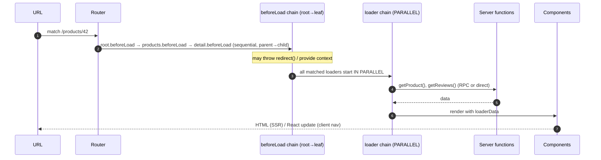

# Module 06 — Route Loaders & `beforeLoad`: Route-Centric Data Loading

> The single most opinionated idea in TanStack: **data loading belongs next to routing.** This module teaches
> the loader lifecycle deeply — including the part everyone gets wrong (`beforeLoad` is UX, not security).

---

## 6.1 Why loaders exist

A route knows something no component, hook, or API layer knows: **which UI is about to render, and therefore
what data it needs.** So the route loader *coordinates that data before rendering commits*:

```
Route knows its UI → Loader coordinates that UI's data → Component receives data as a fact
```

Consequences (all good):

- No fetch-waterfalls inside `useEffect` (parallel by design).
- SSR works automatically — the server runs the same loaders.
- Pending/error UI is declarative per route.
- Caching, preloading, and revalidation attach to the *route*, where the cache key (path+params+search)
  already lives (Module 07).

## 6.2 The lifecycle (first request) `[SERVER]`



Rules to memorize:

1. `beforeLoad` runs **sequentially, parent → child** (it builds context each level consumes).
2. `loader`s run **in parallel** across matched routes.
3. A thrown `redirect()` aborts everything downstream.
4. On the **server** (first request) this all happens during SSR; on **client navigation** the same code runs
   in the browser, with server functions crossed via RPC.

## 6.3 `beforeLoad` — decisions before data `[BOTH]`

FILE: `src/routes/_authed.tsx` (pathless auth layout from Module 03)

```tsx
import { createFileRoute, redirect } from '@tanstack/react-router'
import { getSession } from '~/server/auth/auth.functions' // server function, Module 10

export const Route = createFileRoute('/_authed')({
  beforeLoad: async ({ location }) => {
    const session = await getSession()          // [SERVER] underneath; call site is isomorphic
    if (!session) {
      throw redirect({
        to: '/login',
        search: { redirect: location.href },    // bring the user back after login
      })
    }
    return { user: session.user }               // → added to route CONTEXT for children
  },
  component: ({ children }) => children,        // pathless layout: pass-through
})
```

Realistic uses:

- **Auth checks & redirects** (as above) — for *UX*.
- **Providing route context** (`user`, `org`, feature flags) to child loaders/components.
- **Loading route-specific dependencies** (e.g. an org membership record every child needs).
- **Fast-fail authorization UX** — hiding admin routes from non-admins.

> ⚠️ **DO NOT** — the course repeats this until it's reflexive:
> **`beforeLoad` is not a security boundary.** It can run in the browser; attackers skip browsers.
> Every server function / server route that touches data must authorize *itself* (Modules 14/15). The guard in
> `_authed.tsx` exists so honest users get a login page instead of an error page — not to protect data.

## 6.4 Route context — typed dependency injection down the tree `[BOTH]`

```tsx
// [BOTH] — src/routes/_authed/orders/index.tsx
export const Route = createFileRoute('/_authed/orders/')({
  loader: async ({ context }) => {
    // context.user is typed; provided by _authed.beforeLoad above
    return listMyOrders({ data: { userId: context.user.id } })
  },
})
```

Context sources, in order: (1) `createRouter({ context: … })` initial context (Module 18 uses this for the
Query client), (2) each `beforeLoad`'s return value merged as you descend. Children get the accumulated,
**typed** object. Think of it as `Context.Provider` for routing, checked by the compiler.

## 6.5 `loader` — the coordinator `[BOTH]` (calls into `[SERVER]`)

FILE: `src/routes/products/$productId.tsx`

```tsx
export const Route = createFileRoute('/products/$productId')({
  loaderDeps: ({ params }) => ({ productId: params.productId }),
  loader: async ({ deps }) => {
    // Parallel by construction:
    const [product, reviews] = await Promise.all([
      getProduct({ data: { id: deps.productId } }),      // server function
      listReviews({ data: { productId: deps.productId } }), // server function
    ])
    if (!product) throw notFound()
    return { product, reviews }
  },
})

function ProductPage() {
  const { product, reviews } = Route.useLoaderData() // typed
  // …
}
```

Guidelines:

- **Loaders coordinate; servers compute.** Loaders call server functions (Module 10) which do authz + DB work.
  In a Start app, loaders should rarely contain SQL or secrets.
- Return **plain, serializable** data (the SSR/dehydration boundary demands it).
- Throw `notFound()` for missing resources, `redirect()` for policy, and let unexpected errors bubble to the
  route `errorComponent` (Module 24).

## 6.6 `loaderDeps` — re-run when inputs change `[BOTH]`

```tsx
loaderDeps: ({ search }) => ({ page: search.page, sort: search.sort }),
loader: ({ deps }) => listProducts({ data: deps }),
```

The router deep-compares deps between navigations: changed → loader re-runs (this is how pagination works,
Module 05); unchanged → cached data is reused (Module 07). Deps also feed the cache key.

## 6.7 Pending, error, empty, success — declare all four `[SERVER → CLIENT]`

```tsx
export const Route = createFileRoute('/_authed/orders/')({
  loader: listMyOrdersForRoute,
  pendingComponent: OrdersSkeleton,            // shimmer while loading
  errorComponent: ({ error, reset }) => (      // something went wrong
    <ErrorState error={error} onRetry={reset} />
  ),
  component: () => {
    const orders = Route.useLoaderData()
    return orders.length === 0 ? <EmptyOrders /> : <OrdersTable orders={orders} />
  },
})
```

Module 24 turns this into a house style: **every data surface ships all four states.**

## 6.8 Preloading & caching hooks (forward reference)

- `defaultPreload: 'intent'` on the router → hovering a `<Link>` runs the target's loaders early.
- `staleTime` / `gcTime` on routes control cache reuse (Module 07).
- Loaders participate automatically — you do nothing extra.

## 6.9 Loader anti-patterns

⚠️ **DO NOT** fetch in components when a loader exists for the route — you lose SSR, parallelism, and cache
integration. (Component-local data *that is user-triggered* is a different story — Module 18/Query.)

⚠️ **DO NOT** return class instances, Dates (serialize them), functions, or huge blobs from loaders — they
must survive SSR serialization.

⚠️ **DO NOT** do authorization only in `beforeLoad` and call it a day (see 6.3).

⚠️ **DO NOT** waterfall: `await a(); await b();` when `Promise.all` would do.

## 6.10 Exercises

- **Beginner:** Build `/products` + `/products/$productId` with loaders calling stub server functions (return fake data for now). Add `pendingComponent` and `errorComponent`.
- **Intermediate:** Implement `_authed` layout exactly as 6.3, with a fake `getSession`; verify the `redirect` search param brings users back after "login".
- **Production:** Add per-loader timing headers (`x-loader-ms`) in dev middleware and log which loader dominates on `/dashboard`.
- **Architecture Challenge:** `/dashboard` needs user stats (fast), analytics (2s), and recent orders (500ms). Decide what goes in one parallel loader vs `Promise.all` vs deferred/streaming (Module 09). Write your decision tree.
- **Debug Challenge:** A loader works on client nav but returns different data on hard refresh. Using the lifecycle diagram from Module 01, list three plausible causes (hint: cookies/headers during SSR vs fetch credentials in browser).

🧠 **MENTAL MODEL — Loaders:** routes declare *what the URL means*; loaders declare *what that URL needs*;
the router executes both in the right environment and hands components finished facts.

---

**Next: [Module 07 — The Router Cache & Preloading (SWR Model) →](07-router-cache-preloading.md)**
