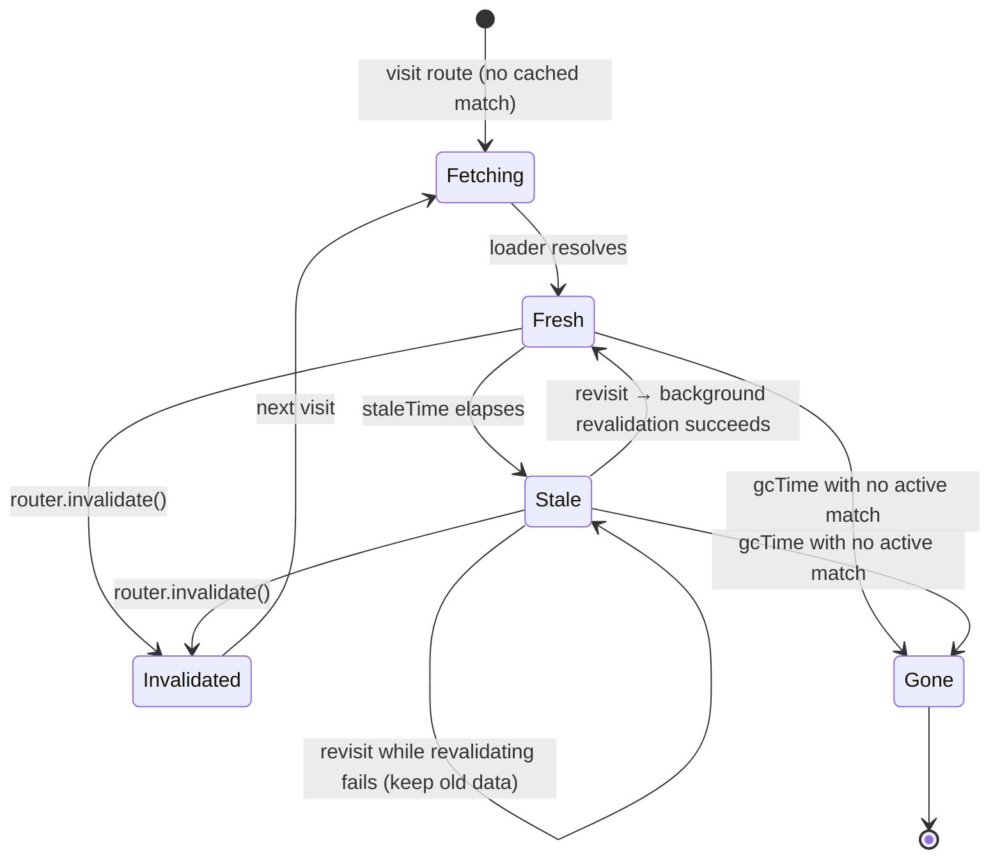

# Module 07 — The Router Cache & Preloading (SWR Model)

> One of the two most-asked architecture questions in this course lives here: *what does the router already
> cache, so I don't over-engineer with Query?* Read this twice.

---

## 7.1 What IS the router cache?

TanStack Router keeps an **in-memory, per-router cache of route matches** — including each route's **loader
data**, status, and timestamps. It is a **stale-while-revalidate (SWR)** cache:

```
visit /products          → loader runs → data cached
navigate to /products/42 → different match (different key)
back to /products        → CACHED data renders INSTANTLY
                           ↳ if stale → background re-run (revalidate)
                           ↳ fresh    → no re-run at all
```

### Answering the five questions

| Question | Answer |
|---|---|
| **WHAT is cached?** | Loader results per *route match*: route id + params + `loaderDeps` output. Not component state, not Query data. |
| **WHERE is it cached?** | In the client's router instance (memory). During SSR the server does this per-request — no cross-user server cache unless you build one (be careful with per-user data!). |
| **WHEN is data stale?** | After `staleTime` (route option) elapses since fetch. Stale data still renders immediately; it just triggers a background revalidation on next visit. |
| **WHEN is it garbage-collected?** | After `gcTime` elapses with no active match referencing it (default is 30 minutes at time of writing — verify in the data-loading guide). GC frees memory; revisit = refetch. |
| **HOW is it invalidated?** | `router.invalidate()` (everything) or filtered invalidation (one route/one key). Mutation handlers call this after server functions succeed. |

> Verify current defaults in the official guide:
> [Router → Data Loading](https://tanstack.com/router/latest/docs/framework/react/guide/data-loading) and
> [Preloading](https://tanstack.com/router/latest/docs/framework/react/guide/preloading).

## 7.2 The cache lifecycle diagram



## 7.3 Tuning per route `[BOTH]`

```tsx
export const Route = createFileRoute('/products/$productId')({
  staleTime: 60_000,   // product pages change slowly: trust data for 1 minute
  gcTime: 10 * 60_000, // keep around 10 min for fast back/forward
  loader: …,
})

export const Route = createFileRoute('/_authed/dashboard')({
  staleTime: 0,        // dashboards: always revalidate on visit
  loader: …,
})
```

Heuristics:

- **Public catalog/detail pages:** generous `staleTime` (30s–5min).
- **User dashboards / tables you mutate:** `staleTime: 0`, invalidate after mutations.
- **Rarely-changing reference data (countries, categories):** long `staleTime`, long `gcTime`.

## 7.4 Invalidation after mutations `[CLIENT]`

FILE: `src/routes/products/-components/favorite-button.tsx`

```tsx
import { useRouter } from '@tanstack/react-router'

export function FavoriteButton({ productId }: { productId: string }) {
  const router = useRouter()
  return (
    <button
      onClick={async () => {
        await toggleFavorite({ data: { productId } }) // server function (Module 10)
        router.invalidate()                            // ← re-run stale loaders on next visit
        // or target exactly one route match:
        // router.invalidate({ filter: (m) => m.routeId === '/products/$productId' })
      }}
    >
      ♥
    </button>
  )
}
```

(The official counter example uses exactly this `router.invalidate()` pattern after a server function.)

## 7.5 Preloading — making navigation feel instant `[CLIENT]`

Preloading runs **route matching + beforeLoad + loaders** *before* the user commits to navigation.

```tsx
// [BOTH] — router.tsx
createRouter({
  routeTree,
  defaultPreload: 'intent',   // hover/focus/touch-intent triggers preload
  // defaultPreloadStaleTime: 30_000 — preloaded data under 30s old is reused (verify current default)
})
```

```tsx
// Per-link control:
<Link to="/products/$productId" params={{ productId: '42' }} preload="intent" />
<Link to="/checkout" preload={false} /> {/* never preload expensive/privileged pages */}

// Programmatic (e.g. prefetch the likely next page after login):
router.preloadRoute({ to: '/dashboard' })
```

What preloading gets you:

1. JS chunk for the route downloads early (lazy-route splitting, Module 03).
2. `beforeLoad` + loaders execute early → data warm.
3. Click → cache hit → **instant paint**.

The compound effect with Module 05: prefetching `/products?search=laptop&page=2` warms exactly that cache key.

## 7.6 What the router cache does NOT cover (setting up Module 18)

- Data shared **across routes** with different shapes (e.g. a cart badge in the header + cart page + checkout).
- **Mutations with lifecycle** (pending/optimistic/error/retry states as first-class state).
- Polling, infinite scrolling, offline persistence, fine-grained key invalidation by entity id.

That's the router-cache-vs-Query decision, handled properly in Module 18. For now:

🧠 **MENTAL MODEL — Router cache:** every route match has a little SWR mailbox. `staleTime` decides when the
mail is re-checked, `gcTime` when the mailbox is removed, `invalidate()` when you empty it by hand, and
preloading is reading tomorrow's mail tonight.

## 7.7 Exercises

- **Beginner:** Visit `/products`, navigate away, come back. Use Router Devtools (`@tanstack/react-router-devtools` — add to `__root.tsx`) to watch the match go fresh → stale.
- **Intermediate:** Add `router.invalidate()` after a favorite-toggle server function; prove the list reflects the change on revisit without a full reload.
- **Production:** Instrument `defaultPreload: 'intent'` and measure navigation TTI with/without preloading on a throttled profile.
- **Architecture Challenge:** Which of these deserve `staleTime: 0`, generous `staleTime`, or no loader at all: pricing page, user profile, order list, category taxonomy, feature flags? Justify each.
- **Debug Challenge:** "The product page shows stale prices for ~30s after an admin edit." Trace it through this module: which setting causes it, what are the three legitimate fixes (invalidation, staleTime, Query), and which is right for a multi-user system? (Hint: client caches can't know about *other users'* mutations — Module 18.)

---

**Next: [Module 08 — SSR & Hydration From First Principles →](08-ssr-hydration.md)**
