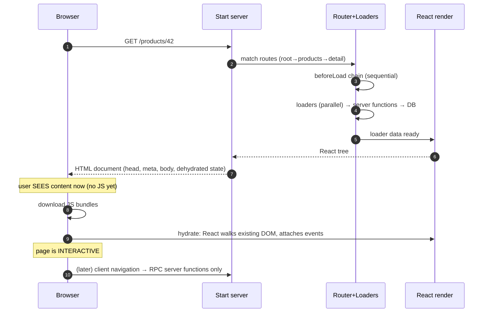

# Module 08 — SSR & Hydration From First Principles

> No magic allowed. By the end of this module you can narrate, byte by byte, what happens between
> “user hits Enter on a URL” and “the page is interactive”.

---

## 8.1 The full timeline



### What data is available when?

| Moment | Available |
|---|---|
| During SSR | Request URL, cookies (server-side), headers, loader data, env secrets (server only) |
| In shipped HTML | Rendered UI + serialized loader data (“dehydrated state”) |
| At hydration | Same loader data rehydrated → no refetch; React event handlers attach |
| After hydration | Browser APIs, localStorage, Query client (Module 18), full SPA mode |

Two facts people miss:

1. **The browser sees useful HTML before any JS runs.** SEO crawlers and slow networks win.
2. **Hydration must produce an identical tree.** If server HTML says “Hello, Sam” and the client first
   render says “Hello, stranger”, you get a hydration mismatch — flicker, warnings, sometimes broken state.

## 8.2 SSR vs CSR vs SSG vs hybrid — with Start's capabilities

| Strategy | What it means | In TanStack Start |
|---|---|---|
| **CSR** | Server ships empty shell + JS; browser fetches data | Possible but wasteful; you'd use plain Router instead |
| **SSR** | Server renders per request with fresh data | ✅ Default: loaders run during SSR, HTML streamed (Module 09) |
| **SSG / static** | HTML generated at build time | Start focuses on dynamic SSR; static-site cases are better served by dedicated tools — treat “build-time HTML” as out of scope and be explicit if a project needs it |
| **Hybrid** | Some routes dynamic, some cacheable, some client-only | ✅ The practical mode: per-route decisions (loaders vs client-only Query, `staleTime` tuning, per-route streaming) |

> Honesty note (Module 00 policy): Start's docs emphasize **SSR + streaming** as the rendering model; if you
> need hard SSG guarantees, evaluate that explicitly rather than assuming it.

## 8.3 Hydration in practice

```tsx
// [SERVER → CLIENT] — __root.tsx: <Scripts/> is what boots hydration.
// The dehydrated payload (loader data — and Query cache when Module 18 wires it)
// travels inside the streamed document, so the client starts warm.
```

Hydration rules that save you hours:

1. **No environment-dependent first render.** `Date.now()`, `Math.random()`, `window.innerWidth` in the first
   render → mismatch. Compute them in `useEffect` (or pass server values down).
2. **Browser APIs live in effects / client-only code** (Module 01 environment functions).
3. **Identical serialization**: loader data must round-trip (plain JSON-ish). Dates → ISO strings.
4. `suppressHydrationWarning` is for genuinely unavoidable cases (e.g. `<html>` theme attribute) — it is not
   a mop for lazy code.

## 8.4 SEO & `<head>` management `[SERVER → CLIENT]`

```tsx
export const Route = createFileRoute('/products/$productId')({
  head: ({ loaderData }) => ({
    meta: [
      { title: `${loaderData?.product.name} — Meridian` },
      { name: 'description', content: loaderData?.product.summary },
      { property: 'og:title', content: loaderData?.product.name },
    ],
  }),
  loader: …,
})
```

Per-route `head()` (verified in the root-route API) composes up the tree; the root provides charset/viewport
defaults (Module 02). Because the meta is rendered during SSR, crawlers see it.

## 8.5 The Start-specific twist: loaders cross environments

Remember Module 01: the *same* loader code runs in two places.

- During SSR: `[SERVER]` — server functions may be called directly, in-process.
- During client nav: `[CLIENT]` — server functions are HTTP calls (cookies ride along; CSRF-checked, Module 25).

Therefore: **never assume a loader has server-only access.** Its superpower (the DB) is always one server
function away, in both environments.

## 8.6 Debugging lab (preview of Module 32)

**Broken:** a product page renders price as `Intl.NumberFormat(undefined, { style:'currency' })` with a locale
read from `navigator.language` directly in render.

**Repro:** hard reload → console hydration warning; price flickers between two locales.

**Diagnose:** server render used the server's default locale; client used the browser's. Two different outputs
for one tree.

**Fix:** server picks locale from `Accept-Language` header and ships it in loader data; client reuses it.

**Mental model:** the server render and the first client render must be *deterministically equal* — every input
they differ on must travel with the document.

## 8.7 Exercises

- **Beginner:** Disable JS in your browser, load `/products`. Catalog what works (everything rendered) and what doesn't (interactivity). This is your SSR proof.
- **Intermediate:** Add per-route `head()` with dynamic titles; verify in View Source.
- **Production:** Add an integration test asserting the SSR HTML of `/products` contains 10 product names before hydration.
- **Debug Challenge:** Introduce a deliberate `new Date().toLocaleTimeString()` in a component's first render. Observe the mismatch, then fix it the “server decides, client obeys” way.

🧠 **MENTAL MODEL — SSR:** the server produces a *photograph* of the app at request time plus the *negative*
(dehydrated state); hydration develops that negative into a living, interactive app without re-shooting.

---

**Next: [Module 09 — Streaming SSR with Suspense →](09-streaming.md)**
